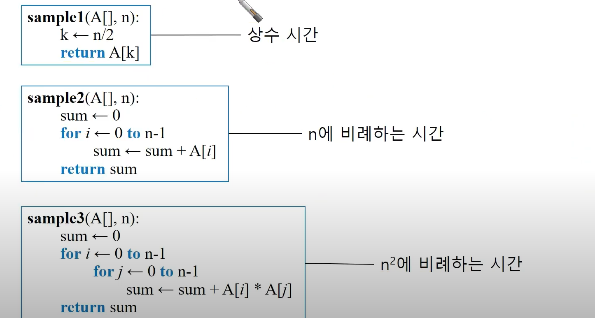
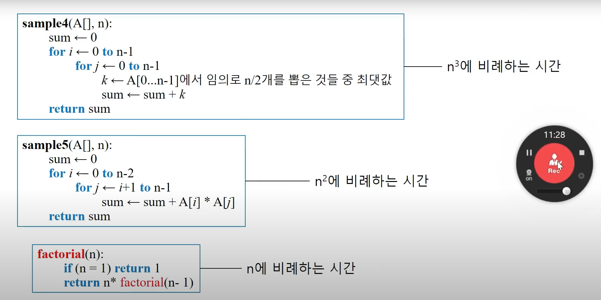
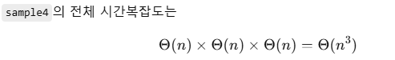

<h1>알고리즘의 수행시간</h1>

**-> 입력크기 n에 대해 시간이 얼마나 걸리는지로 표현**

<ol>입력크기 n의 예시
    <li> 정렬 알고리즘 </li>
    정렬 알고리즘의 경우 정렬할 원소의 개수를 의미 
    <li> 색인 </li>
    색인의 경우 색인에 포함된 원소의 개수를 의미 
    <li> 그래프 </li>
    그래프의 경우 노드의 개수를 의미함
</ol>

점근적 개념에서의 수행시간의 증가 속도 

**점근적 개념 :: 값이 상당히 큰 상태에서 어떻게 변하는지 이해할 때 사용**

수행시간의 증가 속도 (처리하는데 걸리는 시간의 크기 )
 2^n > n^3 > n^2 > nlogn > n > logn


점근적 개념에서는 상수 계수를 무시한다는 특징을 가짐 

<hr>

<h1> 점근적 개념에서의 알고리즘의 수행 시간 예시 </h1>

<h2>시간 복잡도 </h2>
<h3>시간복잡도는 연산횟수가 입력크기 n에 따라 어떻게 변하는지 확인할 수 있는 개념이다.</h3>

만약 상수 * n^2인 경우, 점근적 개념에서의 시간 복잡도에서는 상수를 무시하고 n을 입력하는 크기변화에 따른 증가율을 확인 하기 때문에, 복잡도는 n^2이라고 할 수 있다.



<h2> sample 1 </h2>
```
sample([A] , n ) {
    k = n/2 ;
    return k ; 
}
```

sample1의 경우 n의 크기에 따라 연산 속도가 증가하거나 감소하지 않기 때문에 상수시간이라고 볼 수 있다.

<hr>


<h2> sample 2 </h2>

```
sample 2 (A[], n){
    int sum = 0;
    for (int i = 0; i <n-1; i++){
        sum += A[i];
    }
    return sum;

}

```

sample2의 경우 n의 크기에 따라서 반복문의 연산 횟수가 비례하게 증가하거나 감소한다. 
따라서 해당 로직은 n의 크기에 비례한 연산횟수를 가지며, 이는 시간 복잡도의 정의에 따라 n에 비례하는 시간 복잡도를 가지는 것을 볼 수 있다. 


<h2> sample 3 </h2>

```
sample 3 (A[], n){
    int sum = 0;
    for (int i = 0; i <n-1; i++){
         for (int j = 0; j <n-1; j++){
        sum += A[i] * A[j] ;
        }
    }
    return sum;

}

```

sample3의 경우 sample2와 마찬가지로 n의 크기에 따라서 반복문의 연산 횟수가 비례하게 증가하거나 감소한다. 
그러나 sample2와 차이점은 해당 로직의 경우 n의 크기에 비례한 연산횟수를 2회 가지며, 이는 시간 복잡도의 정의에 따라 n * n  (n^2)에 비례하는 시간 복잡도를 가지는 것을 볼 수 있다. 

<hr>



<h2> sample 4 </h2>

```
sample 4

for i = 0 .. n-1:           //0부터 n-1까지 반복을 가짐 
  for j = 0 .. n-1:         //0부터 n-1까지 반복을 가짐 
    k ← A[0..n-1]에서 임의로 n/2개를 뽑은 것들 중 최댓값
    sum ← sum + k

```

sample4의 경우, 이중 반복문이 n의 값과 비례하여 연산횟수를 갖기에 n^2을 가지나, **이중 반복문의 내부 실행문에서 배열 A[]에서 n/2개를 뽑은 것들 중 최댓값을 구하는 과정**에서 n의 크기만큼 뽑는 개수가 비례하기 때문에 해당 실행문의 시간 복잡도가 n을 가지게 되며, 기존의 n^2가 곱해져, n^3이라는 시간 복잡도를 갖게 된다. 

해당 sample4의 전체 시간 복잡도



<h2> sample 5 </h2>

```
sample 5
for i = 0 .. n-2:           //0부터 n-1까지 반복을 가짐 
  for j = i+1 .. n-1:       //0부터 n-1까지 반복을 가짐 
    sum += A[i] * A[j]
```

sample5의 경우 sample2와 마찬가지로 n의 크기에 따라서 반복문의 연산 횟수가 비례하게 증가하거나 감소한다. 
**또한 이중 반복문을 가지고 있기에, 상수 * n^2의 복잡도를 갖고 있으나, 점근적 시간복잡도에서는 상수계수를 무시하기 때문에 sample5에서는 n^2의 시간 복잡도를 가진다.**


<h2> sample 6 </h2>

```
sample 6
function(n)
    if n == 1: return 1
return n * factorial(n-1)

```

sample6의 경우, 팩토리얼을 나타낸 코드이며, 해당 코드에선 baseCase와 ,순환Case가 존재하는 것을 볼 수 있다.
**여기서 baseCase의 경우 n이 1일 경우에 로직이며, 해당 로직은 n과 관련이 없는 상수시간임을 알 수 있음 ( 조건문에서는 n이 1일 때의 조건이기에 n에 비례는 상관이 없음 )**
그러나 순환Case의 경우에는 n의 크기에 따라서 연산횟수가 달라지고, n의 크기에 비례하여 연산횟수도 마찬가지로 비례하는 것을 볼 수 있다. 
그렇기에 sample6의 시간복잡도는 n이라고 볼 수 있다. 
