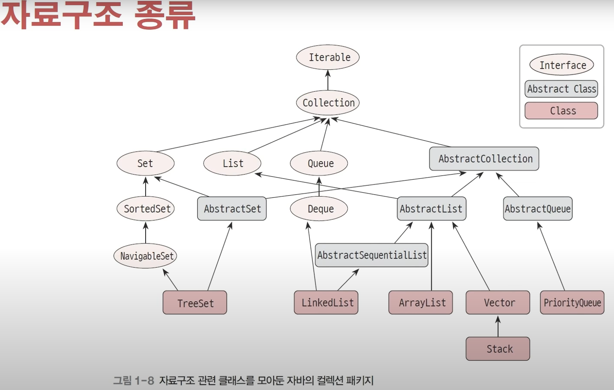
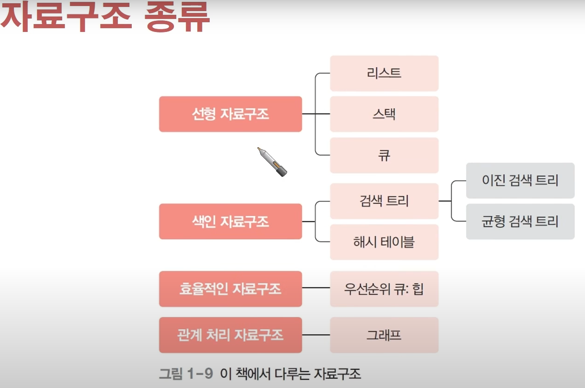

[그림 1]

해당 그림 1을 통해서, 자료구조 관련 클래스를 모아둔 자바의 컬렉션 패키지를 볼 수 있다. 

화살표의 머리를 향하는 부분을 화살표의 머리가 없는 부분에서 상속 받는다 

그림 1을 토대로 설명시 TreeSet은 AbstractSet의 상속을 받는다. 

[그림 2]

해당 로드맵을 보고 어떠한 내용을 자세하게 배울 수 있을 지 알 수 있다. 
