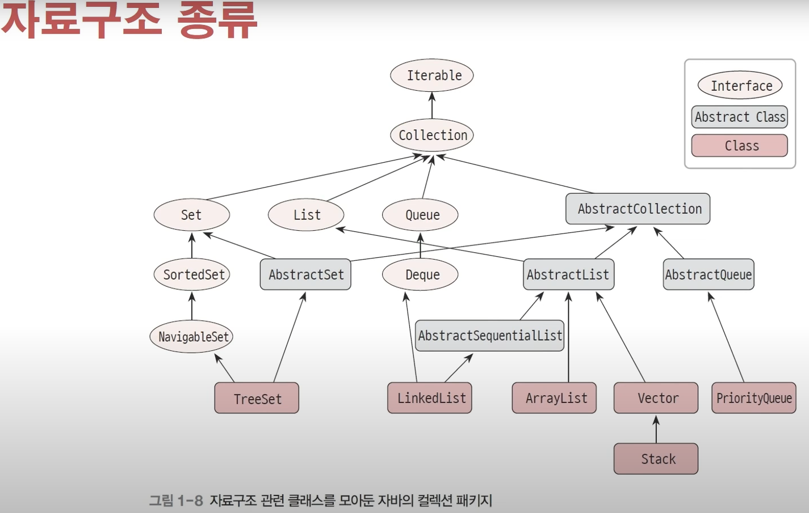
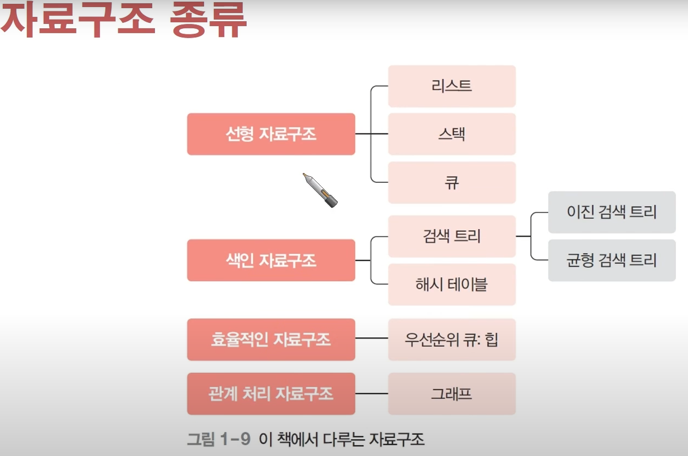
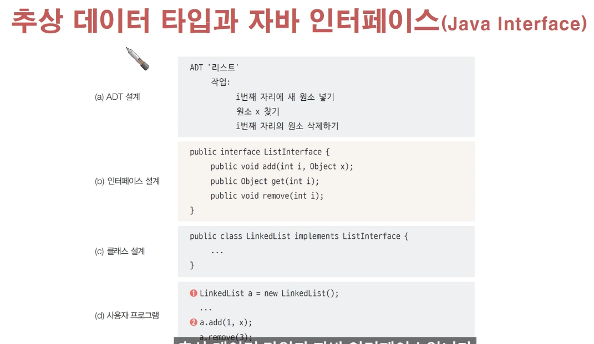
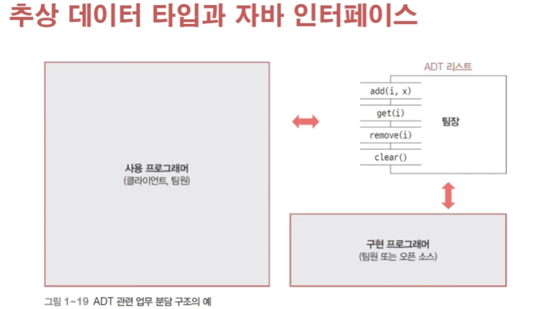

<ol>
<li>day 1</li>
<li>day 2</li>
<li>day 3</li>
</ol>

<h1>Day1</h1>

[그림 1]

해당 그림 1을 통해서, 자료구조 관련 클래스를 모아둔 자바의 컬렉션 패키지를 볼 수 있다. 

화살표의 머리를 향하는 부분을 화살표의 머리가 없는 부분에서 상속 받는다 

그림 1을 토대로 설명시 TreeSet은 AbstractSet의 상속을 받는다. 

[그림 2]

해당 로드맵을 보고 어떠한 내용을 자세하게 배울 수 있을 지 알 수 있다. 

<h1>Day2</h1>

ADT : 추상 데이터 타입 
: 추상적으로 정의한 데이터 타입

: 어떤 데이터 타입이 어떤 작업으로 이루어지는지 표현

[그림3]

위의 그림3을 통해서, **ADT 설계의 ADT '리스트'가 사용자 프로그램의 LinkedList**까지 어떻게 변하는지 볼 수 있다. 

(b) 인터페이스 설계를 통해서, 추상 메소드를 생성하고, 
(c) 클래스 설계를 통해서 추상 메소드 내부의 내용을 채워서 작성할 수 있다. 

[그림4]

위의 그림4는 ADT 업무 분담 이미지를 예시로 이해를 돕고 있다.
